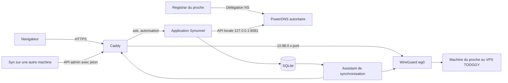

# Architecture du MVP

## Flux

L'application Flask/Gunicorn écoute uniquement sur `127.0.0.1:8000`. PowerDNS répond en autoritaire sur les IP publiques du VPS, tandis que son API est limitée à `127.0.0.1:8081`. Caddy écoute sur 80 et 443. WireGuard écoute sur 51820/UDP et attribue une adresse `10.88.0.x` par machine. `systemd-resolved` conserve ses sockets locaux en 127.0.0.53/54.

## Base et synchronisations

La base `/var/lib/synunnel/synunnel.db` contient comptes, domaines, enregistrements, machines, adresses, listes d'adresses mail autorisées, sessions d'accès et journal des appels admin. Elle ne contient **aucune clé privée WireGuard cliente**. La clé serveur est dans `/etc/wireguard/synunnel-server.key`, et l'application ne la lit pas. Pour le VPS TOOGGY, le CLI crée une configuration cliente en mémoire et la transmet par un flux SSH au fichier root `0600` de l'autre machine, une fois le compte de Ludo approuvé.

À l'ajout d'un domaine, l'application interroge d'abord le DNS public. Elle relève A, AAAA, MX, TXT et CAA à la racine ; CNAME, A, AAAA et TXT sur `www` ; TXT sur `_dmarc` ; et TXT/CNAME pour les sélecteurs DKIM courants et fournis. Elle crée ensuite la zone par l'[API PowerDNS](https://doc.powerdns.com/authoritative/http-api/zone.html) et y installe ces enregistrements, NS, SOA, ainsi qu'un joker A/AAAA vers le VPS. L'ajout d'une adresse produit aussi un A/AAAA explicite, car un nom déjà présent pour un autre type DNS empêcherait le joker de répondre. Une adresse racine `@` remplace les A/AAAA copiés dans la zone active, mais garde ces enregistrements en base pour restauration et préserve MX/TXT. Les changements de zone sont effectués par l'API, et les opérations SQLite sont annulées si l'API refuse le changement.

La délégation est observée directement auprès d'un serveur de la zone parente. Le statut ne dépend pas du cache récursif du VPS. Les deux noms NS pointent vers le même serveur pour le MVP.

L'assistant `/usr/local/sbin/synunnel-sync`, possédé par root et appelé par une entrée sudoers limitée, lit la base, valide les noms, IP, ports et clés publiques, puis régénère `/etc/caddy/synunnel-routes.caddy` et `/etc/wireguard/wg0.conf`. Il vérifie Caddy avant rechargement et utilise `wg syncconf` pour éviter de couper le tunnel des autres pairs. `wg-quick@wg0` nécessite les privilèges réseau du système ; Flask tourne comme utilisateur dédié `synunnel`, Caddy comme `caddy` et PowerDNS comme `pdns`.

## HTTPS et contrôle d'accès

Le Caddyfile est généré depuis `/etc/synunnel/synunnel.env`, avec le tableau de bord sur `synunnel.fr` et les redirections `synunnel.com`/`www`. Il contient une route HTTPS générique avec `tls { on_demand }`. Son [contrôle `ask`](https://caddyserver.com/docs/caddyfile/options#on_demand_tls) interroge `/internal/caddy/ask` avant toute émission. L'application répond 204 uniquement pour le tableau de bord, les deux alias de redirection et une adresse enregistrée sous un utilisateur validé ; elle répond 403 pour tout autre nom. Les trois noms système sont des exceptions explicites, car ils n'appartiennent à aucun compte utilisateur.

Chaque route Caddy utilise [un contrôle préalable `forward_auth`](https://caddyserver.com/docs/caddyfile/directives/forward_auth). Pour une adresse publique, l'application vérifie que la route existe toujours et que son propriétaire est validé. Pour une adresse protégée, elle exige aussi un cookie d'accès limité à cet hôte. Un rechargement Caddy raté peut laisser une ancienne route en mémoire, mais ce contrôle la refuse après suppression dans la base.

La protection d'une adresse sur un domaine tiers ne peut pas réutiliser le cookie du tableau de bord. Un visiteur est redirigé vers le tableau de bord, se connecte, puis reçoit un code à usage unique de deux minutes pour son adresse. Le callback sur cette adresse crée un cookie `Secure`, `HttpOnly` et `SameSite=Lax`, valable 12 heures. Le code est stocké sous forme d'empreinte et consommé une fois. Le propriétaire passe toujours ; un autre compte doit être approuvé et figurer dans la liste de cette adresse si le partage est activé. La connexion, le callback et **chaque requête** vérifient l'autorisation courante. Modifier la liste révoque aussi les codes et sessions d'accès existants.

Le VPS TOOGGY, distinct du VPS Synunnel, sera un pair ordinaire en `10.88.0.3/32`. Sa landing statique écoutera seulement sur `10.88.0.3:18080`, sans toucher aux ports 80/443, aux conteneurs Docker ni à l'API de l'application TOOGGY. Le compte et le tunnel réel n'existent pas encore : le service préparé sur ce VPS reste désactivé tant que Ludo n'a pas créé son compte et que les enregistrements OVH ne sont pas posés.

## Configuration et reprise

- Dépôt : `/home/ubuntu/synunnel`, Git local seulement.
- Secrets et paramètres : `/etc/synunnel/synunnel.env` (root, groupe synunnel, mode 0640), jamais dans Git.
- Base applicative : `/var/lib/synunnel/synunnel.db` (utilisateur synunnel).
- PowerDNS : `/etc/powerdns/pdns.d/synunnel.conf` et `/var/lib/powerdns/synunnel.sqlite3`.
- Caddy : `/etc/caddy/Caddyfile` et le fichier de routes généré.
- WireGuard : `/etc/wireguard/synunnel-server.key` et `wg0.conf`, mode 0600.

Le script `scripts/install.sh` peut être relancé sans renouveler les secrets. Il régénère le Caddyfile depuis les paramètres validés, sauvegarde la version précédente et aligne les NS/SOA des zones existantes ; la migration est sans effet si les valeurs sont déjà correctes. La procédure d'installation et les vérifications courantes sont dans le [README](../README.md). Une sauvegarde restaurable des deux bases, des secrets et des certificats Caddy reste à mettre en place avant d'accueillir des domaines importants.
