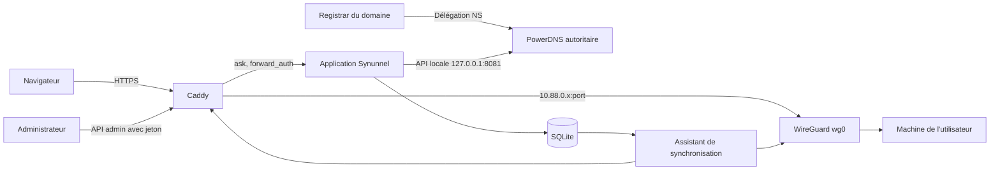

# Architecture

## Flux

L'application Flask servie par Gunicorn écoute uniquement sur `127.0.0.1:8000`. PowerDNS répond en autoritaire sur les IP publiques du VPS, son API reste limitée à `127.0.0.1:8081`. Caddy écoute sur 80 et 443. WireGuard écoute sur 51820/UDP et attribue une adresse `10.88.0.x` par machine (253 machines au plus par instance dans cette version).

## Base et synchronisations

La base `/var/lib/synunnel/synunnel.db` contient comptes, demandes de domaine en attente de preuve, domaines, enregistrements, machines, adresses, listes d'invités, sessions d'accès et journal des appels admin. Elle ne contient **aucune clé privée WireGuard**. La clé du serveur est dans `/etc/wireguard/synunnel-server.key` ; l'application ne la lit pas.

**Ajout d'un domaine.** Le compte dépose d'abord une demande, qui porte un jeton aléatoire. Synunnel affiche le TXT `_synunnel.<domaine>` correspondant. À la vérification, il trouve la zone qui contient le domaine, interroge directement ses serveurs faisant autorité et compare les valeurs lues au jeton. Si la preuve est là, il relève le DNS public : A, AAAA, MX, TXT et CAA à la racine ; CNAME, A, AAAA et TXT sur `www` ; TXT sur `_dmarc` ; TXT et CNAME pour les sélecteurs DKIM courants et ceux fournis. Il crée ensuite la zone par l'[API PowerDNS](https://doc.powerdns.com/authoritative/http-api/zone.html) avec ces enregistrements, les NS et le SOA de l'instance, et un joker A/AAAA vers le VPS. Si l'API refuse, la zone et les écritures SQLite sont annulées.

Chaque adresse produit un A/AAAA explicite, car un nom déjà présent pour un autre type empêcherait le joker de répondre. Une adresse racine `@` remplace les A/AAAA copiés dans la zone active, les garde en base pour pouvoir les restaurer, et préserve MX et TXT.

La délégation est observée directement auprès d'un serveur de la zone parente, sans dépendre du cache récursif du VPS.

**Synchronisation système.** L'assistant `/usr/local/sbin/synunnel-sync`, possédé par root et appelé par une entrée sudoers limitée, prend un verrou exclusif, lit pairs et routes dans une seule transaction SQLite, revalide noms, IP, ports et clés publiques, puis régénère `/etc/wireguard/wg0.conf` et `/etc/caddy/synunnel-routes.caddy`. Il valide Caddy avant de le recharger et applique WireGuard par `wg syncconf`, sans couper les autres pairs. Si le tunnel est arrêté, il le relance. En cas d'échec, l'ancien fichier est restauré.

**Pare-feu du tunnel.** `wg0.conf` charge au démarrage de l'interface la table nftables `synunnel_wg` (`/etc/synunnel/wg0-firewall.nft`) : seules les réponses aux connexions ouvertes par le VPS entrent par `wg0`, et rien ne transite d'une machine à l'autre.

## HTTPS et contrôle d'accès

Le Caddyfile est généré depuis `/etc/synunnel/synunnel.env` : tableau de bord sur `DASHBOARD_HOST`, redirections 308 éventuelles depuis `REDIRECT_HOSTS`, puis une route HTTPS générique avec `tls { on_demand }`. Le [contrôle `ask`](https://caddyserver.com/docs/caddyfile/options#on_demand_tls) interroge `/internal/caddy/ask` avant toute émission de certificat ; l'application n'autorise que les noms de l'instance et les adresses enregistrées sous un compte approuvé.

Chaque route passe par [`forward_auth`](https://caddyserver.com/docs/caddyfile/directives/forward_auth). Pour une adresse publique, l'application vérifie que la route existe toujours et que son propriétaire est approuvé. Pour une adresse protégée, elle exige en plus un cookie d'accès limité à cet hôte.

Une adresse protégée vit sur le domaine de l'utilisateur et ne peut donc pas lire le cookie du tableau de bord. Le visiteur est redirigé vers le tableau de bord, se connecte, puis revient avec un code à usage unique de deux minutes sur `/__synunnel/auth/callback`. Ce callback crée un cookie `Secure`, `HttpOnly`, `SameSite=Lax`, valable 12 heures. Le propriétaire passe toujours ; un autre compte doit être approuvé et figurer dans la liste de l'adresse. La connexion, le callback et chaque requête vérifient l'autorisation courante.

## Emplacements

| Élément | Chemin |
| --- | --- |
| Code | le dépôt cloné, là où `install.sh` a été lancé |
| Paramètres et secrets | `/etc/synunnel/synunnel.env` (root, groupe `synunnel`, 0640) |
| Base applicative | `/var/lib/synunnel/synunnel.db` |
| PowerDNS | `/etc/powerdns/pdns.d/synunnel.conf`, `/var/lib/powerdns/synunnel.sqlite3` |
| Caddy | `/etc/caddy/Caddyfile`, `/etc/caddy/synunnel-routes.caddy`, données dans `/var/lib/caddy/` |
| WireGuard | `/etc/wireguard/synunnel-server.key`, `/etc/wireguard/wg0.conf` (0600) |
| Pare-feu du tunnel | `/etc/synunnel/wg0-firewall.nft` |

`scripts/install.sh` peut être relancé sans renouveler les secrets. Il régénère le Caddyfile, sauvegarde la version précédente, aligne les NS et SOA des zones existantes si les noms de serveurs ont changé, et réapplique le pare-feu du tunnel.
